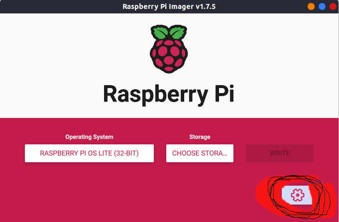

So here we go again...  


Every so often my plex craps out on me. Not plex's fault, it seems to be the sd cards the operating system is installed on.   
So every so often I have to go through the process of setting it up again.  
Now, what I really should do is automate the process so I dont have to continually go through this bi-annually, but... well there are lots of things I *should* do but dont. 

Anyway this is my process for installing Plex, Transmission, Sonarr, and Jjacket on a Raspberry Pi 3. 

1. Get the Raspberry Pi imager - https://www.raspberrypi.com/software/
2. Dont forget to go into the settings on the imager. You can set up the wifi connection and user in there and it'll save a bit of hassle.  
   
      
  
### If you forget to set up wifi 
Get your *SSID* and *wifi password*  
Create a `wpa_supplicant.conf` file with the following content  

```conf  
ctrl_interface=DIR=/var/run/wpa_supplicant GROUP=netdev
network={
  ssid="SSID"
  ctrl_interface=DIR=/var/run/wpa_supplicant GROUP=netdev
  psk=<wifi password>
}
```  

### if you forget to set up a user  
Get an encrypted version of the password you want to use  
`echo <the password i want to use> | openssl passwd -6 -stdin`  

the create a `user.conf` file with the following content   
```conf
<username>:<encrypted_password_output>
```
    
Okay next you need to create an empty `ssh` file with no extension.  

Copy all three of these files, or just the `ssh` file (if you used the imager for the other 2) to the boot drive of your formatted SD card.  

Put the SD card in the Pi and start her up!  


